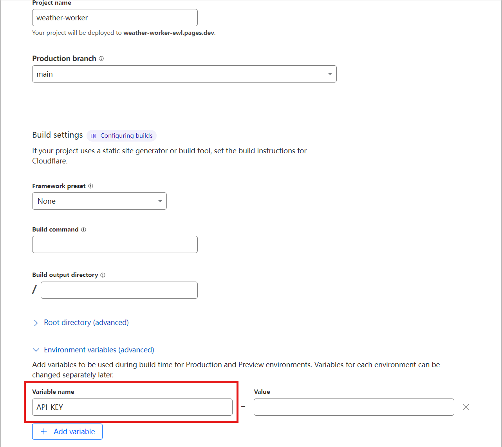

# weather-pages
cloudflare pages get weather

# Environment variables

Please apply for apikey in https://openweathermap.org/.

```
API_KEY = 123456
```
# Setting

## 1. add Environment variables


## 2. Just keep everything else by default.
